# T3A2 Part A - Documentation

This repository contains documentation for a web application project which is to be completed as a group as part of a course in web development.  The brief for this project was to create a web application for a real business client, which solved a challenge their facing the business.  The 'real' requirement has been dropped, however, due to the difficulties presented by the COVID-19 pandemic.  Our project will create a restaurant menu and ordering web application for an imaginary restaurant.

This repository contains documentation only; the source code for the [back end is here](https://github.com/korayleigh/t3a2-b-backend), and the [front end is here](https://github.com/korayleigh/t3a2-b-frontend)

---

- [T3A2 Part A - Documentation](#t3a2-part-a---documentation)
  - [Trello Board Link](#trello-board-link)
  - [Github Repository Link](#github-repository-link)
  - [Purpose](#purpose)
  - [Functionality / Features](#functionality--features)
    - [Customers](#customers)
    - [Kitchen](#kitchen)
    - [Wait staff](#wait-staff)
    - [Manager](#manager)
    - [App Administrator](#app-administrator)
    - [Future Features](#future-features)
  - [Target Audience](#target-audience)
  - [Tech Stack](#tech-stack)
    - [Front-end](#front-end)
      - [React](#react)
        - [Key React Dependencies](#key-react-dependencies)
      - [Supported browsers](#supported-browsers)
      - [ECMAScript](#ecmascript)
      - [Hosting](#hosting)
    - [Back-end](#back-end)
      - [Ruby on Rails](#ruby-on-rails)
        - [Key Rails Dependencies](#key-rails-dependencies)
      - [Hosting](#hosting-1)
    - [Database](#database)
      - [Database type and version](#database-type-and-version)
      - [Hosting](#hosting-2)
    - [Development tools](#development-tools)
  - [Dataflow Diagram](#dataflow-diagram)
    - [Menu, Orders and Users](#menu-orders-and-users)
  - [Application Architecture Diagram](#application-architecture-diagram)
  - [User Stories](#user-stories)
    - [Menu](#menu)
    - [Orders](#orders)
    - [Users](#users)
  - [Wireframes](#wireframes)
    - [Mobile](#mobile)
    - [Tablet](#tablet)
    - [Desktop](#desktop)
  - [Planning Methodology](#planning-methodology)
    - [Source Control Methodology](#source-control-methodology)
    - [Trello screenshots](#trello-screenshots)
    - [Daily Standup Meeting Minutes](#daily-standup-meeting-minutes)

---

## Trello Board Link

[Trello Board](https://trello.com/b/CoWRRx5z/full-stack-app)

---

## Github Repository Link

[Github Repo](https://github.com/korayleigh/t3a2-a)

---

## Purpose

Our web application is designed to replace manual pen and paper processes for browsing the restaurant menu, and placing an order.  It was conceived for use by customers when seated in the restaurant, however it can also provide for take-away orders.

Customers will be able to browse the restaurant menu on their own smart device while seated at their table, view the details and images of dishes, add them to their cart and finalise the order.  This allows the restaurant to run more efficiently, with lower reliance on human wait staff, and less chance of human errors such as communication, or mislaid orders. In addition, from the customer's perspective it facilitates a smoother, more convenient ordering process.

The web application will also replace other processes in the restaurant relating to orders, such as as notifying the kitchen of pending dishes, and the customer service and other functions performed by the manager.  The web application will provide interfaces for different types of users to enable them to see the order information most relevant to them, and interact with it according to their role.

---
## Functionality / Features

The below features are grouped according to the anticipated roles of users of the web application, and constitute the agreed minimum viable product (MVP) of the web application.

### Customers

Customers will be able to view general information about the restaurant from the landing page including the a description of the restaurant, the physical address, contact information, and view general images of the restaurant, such as street position, dining rooms,  and the team.

The main feature for customers is the restaurant menu.  Customers may browse the full menu, or search and filter it for a more specific view.  Customers with specific dietary requirements will be able to filter the menu to only display dishes compatible with their needs. 

To best communicate each dish to the customer, images will accompany each menu item, and each item can be clicked for more detailed description and specific details, such as ingredients, spiciness, and allergy information etc.

Once a suitable dish is found, customers can then add it to their order, building up a full order for their group.  Customers may be either dining in the restaurant, or making an order for pick-up, and the order process will gather this information. Once finalised, the customer will view a summary of the items on their order, and be asked to confirm their order, after which it begins processing.

At this stage, payment for the order will still be handled manually, as per current process.  For dine-in orders this is at the end of the meal, and for take-away orders at time of pick-up.  However, in future versions of the application online payment is planned, as part of the finalisation of the order.

After finalising the order, the customer can view an order summary and can monitor the status of the order as it is being prepared.

### Kitchen

From the landing page, kitchen users will be able follow a link to a login page, so they may access the interface for the kitchen role.

From this interface, they will be able to see pending dishes from finalised orders that are waiting to be cooked by the kitchen.  

As those dishes are cooked the chef can update the status of the dish, which can be viewed by the customer or others.

### Wait staff

Wait staff are the initial customer service contact for customers in the restaurant.  After logging in, they will be able to view details of all orders, so that they may discuss the order with the relevant customer.  In case of customer service issues beyond requiring remediation, wait staff may contact a manager.

### Manager

The manager of a restaurant is usually tasked with ensuring a smooth operation and dealing with any customer service issues that may arise.  To enable this, the manager is given greater privileges to modify orders and their contents.

After logging in, the manager can view all orders and change any detail of an order, even if it is already cooked or delivered to the customers table.  They could change the price charged for a dish, or delete it entirely from the order. This enables them to provide appropriate remediation for any customer service issues such as quality or errors on behalf of the restaurant.

The manager is also able to make changes to the menu, such as adding, removing or editing menu items.  They may also hide an item from customer view if it is no longer available. 

Managers will also have the ability to view the same interface as wait staff and kitchen users, enabling to monitor these aspects of the restaurant operation.

### App Administrator

In the day-to-day operation of the restaurant, the different roles list above have different privileges and responsibilities, according to the rules of the business.

The application administrator is a special role that has the ability to create new users, and view, edit or delete existing users.  The administrator may customise which components of functionality and the user interface are available to which roles, and can assign role to users, which enables them to perform their associated business functions as detailed above.

### Future Features

While not included in the MVP, the following are some additional features that may be added in future versions of the application.

- The ability for customers to make bookings for tables at the restaurant.
- A payment gateway at the end of the order process, removing the need for manual payment.
- User accounts for customers, so that regular customers can login to their account to save user preferences, interact with customer functions faster, and benefit from loyalty promotions.
- Enable customers to provide ratings and comments for items on the menu.
- Email communications, for promotions, booking confirmations etc.
- Live messaging, for customer service and other purposes, for customers in the restaurant or for queries relating to take-away orders or bookings.
- Promotions, targeted discounts for loyal customers, and integration of promotion codes etc. into the order process.
- Business monitoring and decision-making tools, including sales summaries over various periods, and statistics such as the relative popularity of dishes.

---

## Target Audience

The target audience for this web application is both customers and employees of the restaurant.

Customers may be prospective, in that they are researching a place to dine, and may use the landing page and the menu to help them research and decide whether to choose our restaurant.

Actual customers may include both those that are dining in the restaurant, or those who may choose to come to the restaurant to pick-up a take-away order.  In either case dine-in and take-away customers live locally, as they must at some point be physically present at the restaurant location.

The employees of the restaurant are assigned different roles in the running of the business.  They include wait staff, kitchen staff, and managers, however in the current pen and paper process, the lines that delineate these roles can be somewhat fuzzy.  For example a kitchen staff member could also perform waiting duties, and a manager could perform any function.

---

## Tech Stack

The following technology is planned for use in the development, deployment and maintenance of the web application.

### Front-end

The front-end portion of this web application will be implemented using React.

#### React

**React version:** 17.0.2

##### Key React Dependencies

|Dependency|Version|
|---|---|
|react-scripts|v5.0.0|
|react-router|v6.2.1|
|styled-components|v0.1.0|
|axios|0.25.0|

#### Supported browsers

  ||Google Chrome|Mozilla Firefox|Apple Safari|
  |---:|:---:|:---:|:---:|
  |Version|97.0|96.0|15.3|

#### ECMAScript

**ECMAScript version:** ECMAScript 2020 (ES11)
#### Hosting

Netlify will be used to host the front-end content of this web application

### Back-end

The back end web application framework that will be implemented is Ruby on Rails.

#### Ruby on Rails

**Rails version:** 6.1.4.4
**Ruby version:** 2.7.4

##### Key Rails Dependencies
|Dependency|Version|
|---|---|
|devise|4.8.1|
|devise-jwt|0.9.0|
|aws-sdk-s3|1.111.3|
|cors|1.0.1|

#### Hosting

The back-end web application framework content will be hosted on Heroku.
### Database

A relational database will store the data for this web application.
#### Database type and version
PostgreSQL v14.1

#### Hosting

The PostgreSQL database will be hosted on Heroku.

### Development tools

The following tools are used in the development and maintenance of this application

- VS Code v1.63
- git v2.30

---
## Dataflow Diagram

The following diagram represents the entities and data stores involved in this web application, and the data that will flow between them.

### Menu, Orders and Users

Note: Payments feature is not included in MVP and is shown here for illustrative purposes only. Online payment is planned for a future version

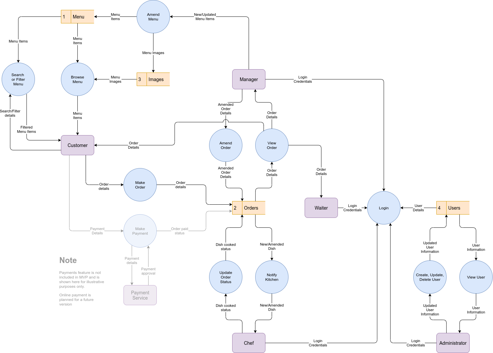
[Click here for full image](https://github.com/korayleigh/t3a2-a/blob/main/docs/dataflow_diagram/dataflow_diagram_menu_and_orders_and_payment_and_users.drawio.png)

---
## Application Architecture Diagram

The following diagram represents a high level structure of the web application showing major components.

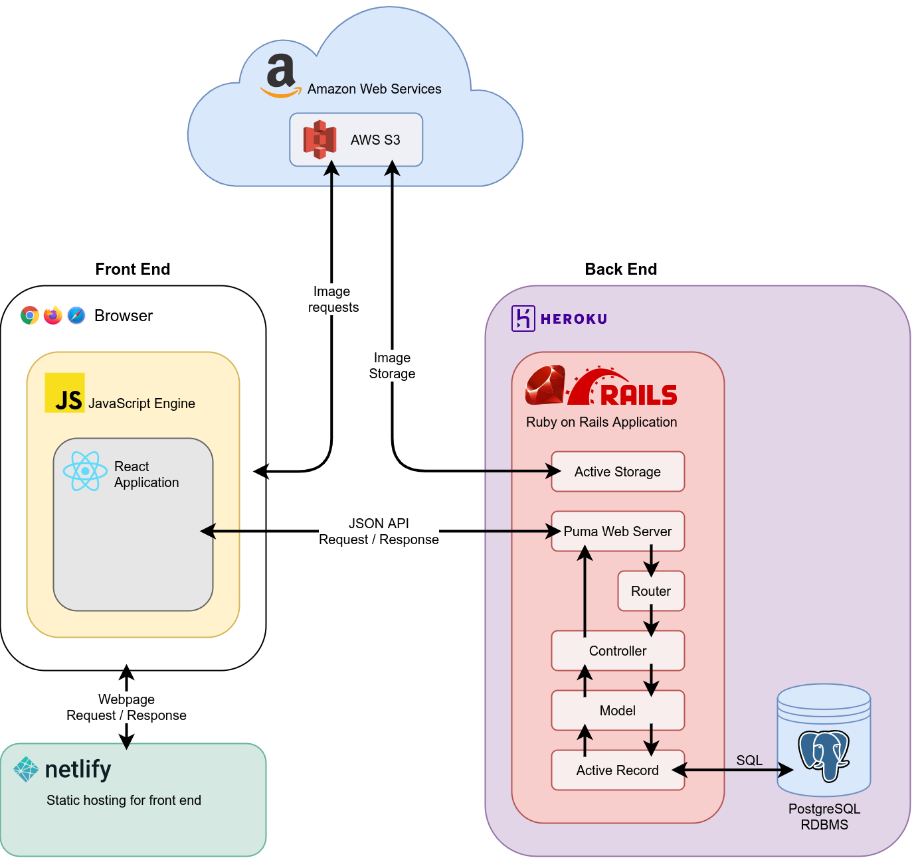
[Click here for full image](https://github.com/korayleigh/t3a2-a/blob/main/docs/application_architecture_diagram/application_architecture_diagram.drawio.png)

---
## User Stories

The following user stories describe the intended features of the web application from the point of the intended users.  They are grouped under headings of broader functionality.

Please note, the user stories below are the final versions. Please see the various git branches (user_stories and others) and commits for evidence of revision and refinement.

### Menu

- As a customer, I want to browse available dishes, so I can decide what to order.
- As a customer, I want to search the menu for a particular dish, so I can find it quickly without scrolling for ages.
- As a customer, I want to filter the menu to dishes of a particular category, ingredient, spiciness, or food allergy, to customise the list to my needs.
- As a manager, I want to manage the list of available menu items, so I can ensure customers are well informed.
- As a manager, I want to add images to menu items, so that the customer can better visualise them.

### Orders

- As a customer, I want to build an order so I can purchase multiple dishes at once
- As a customer, I want to see the status of my order, so can know it's progress
- As a waiter, I want to see all current orders, so I may assist customers with any queries.
- As a chef, I want to see information about pending orders and dishes, so I can prioritise and cook them.
- As a manager, I want to see information about pending orders dishes, so I can monitor the kitchen's progress and restaurant operations.
- As a manager, I want to edit details of orders, so that I can make changes for customer service or other reasons.

### Users

- As the owner and administrator of the website, I want to be able to restrict access to staff-only features (such as the orders dashboard), so that general users of the site (such as customers) will not be able to access these functions.

---

## Wireframes

The pdf version of our wireframes are interactive, with clickable links to navigate the app wireframes like a prototype.

Therefore, for the best experience, please refer to the pdf wireframes documents:

- [t3a2-a/docs/wireframes/mobile_mvp.pdf](./docs/wireframes/mobile_mvp.pdf)
- [t3a2-a/docs/wireframes/tablet_mvp.pdf](./docs/wireframes/tablet_mvp.pdf)
- [t3a2-a/docs/wireframes/desktop_mvp.pdf](./docs/wireframes/desktop_mvp.pdf)

To view pdfs directly in VSCode you can use the following extension:
[tomoki1207.pdf](https://marketplace.visualstudio.com/items?itemName=tomoki1207.pdf)

### Mobile

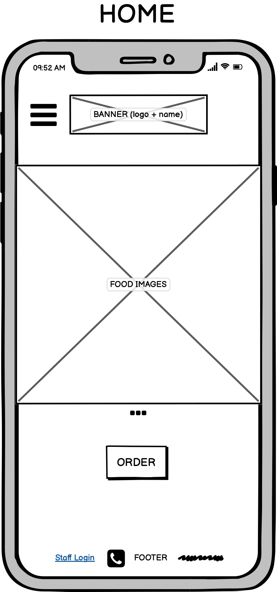

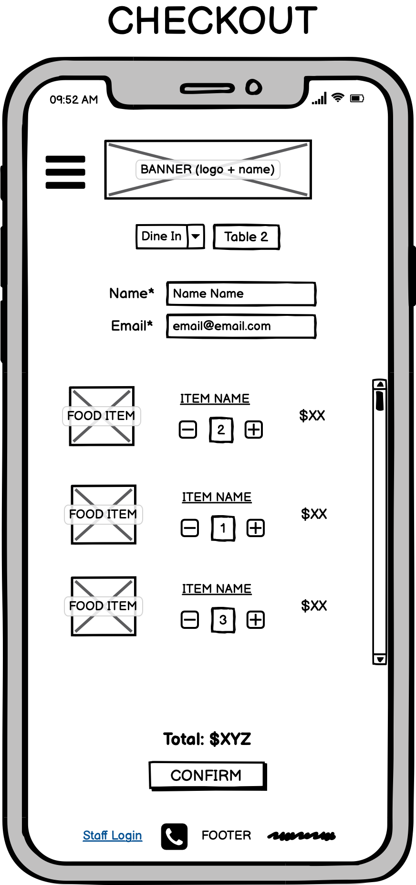
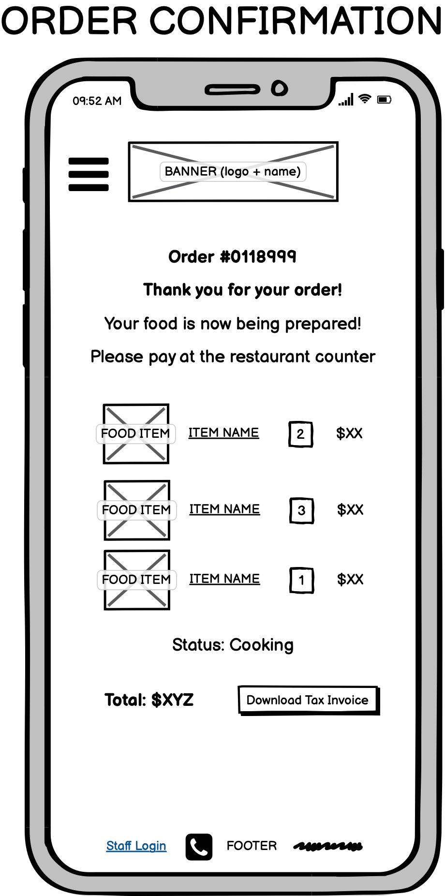

### Tablet

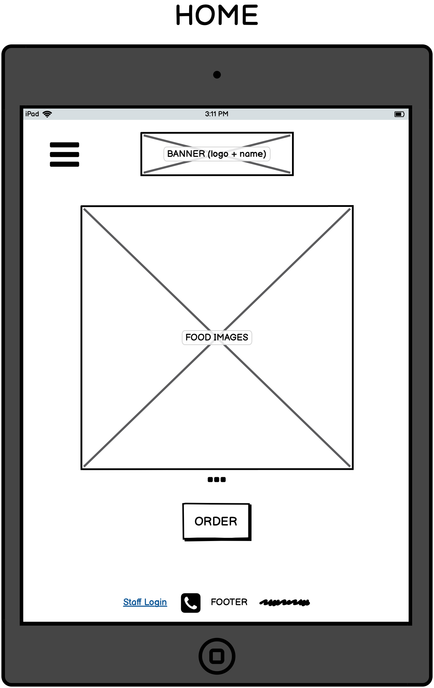

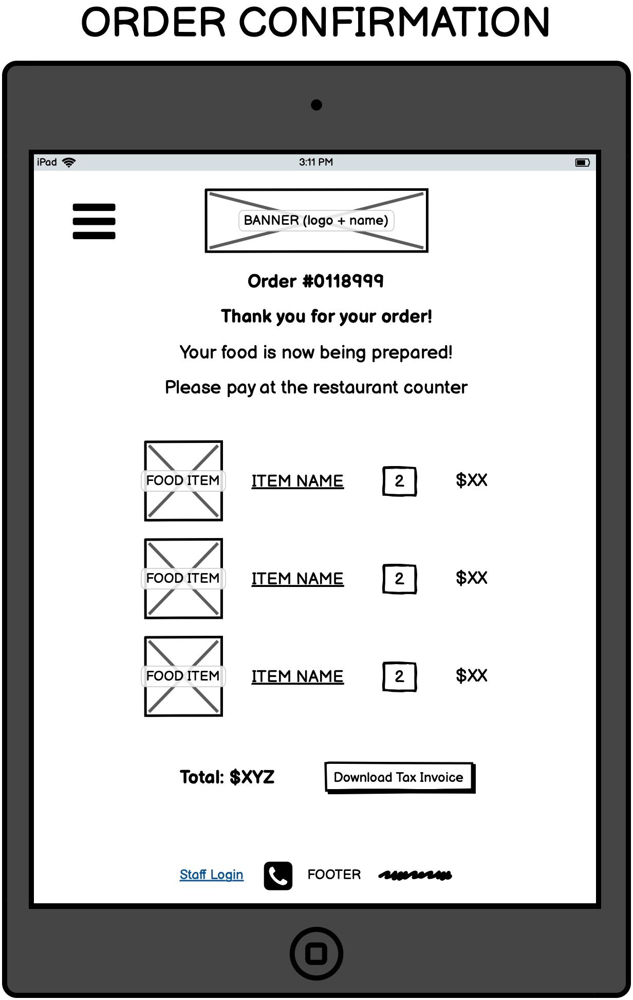

### Desktop

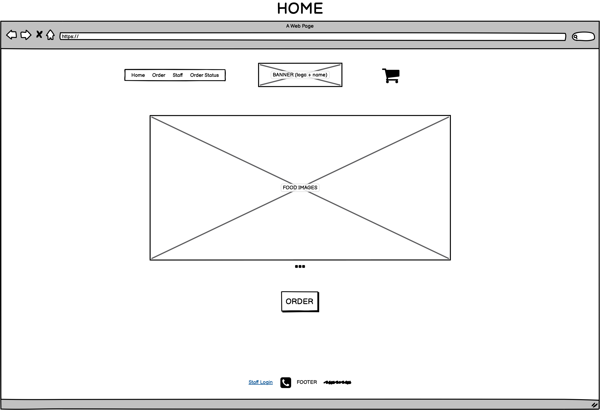

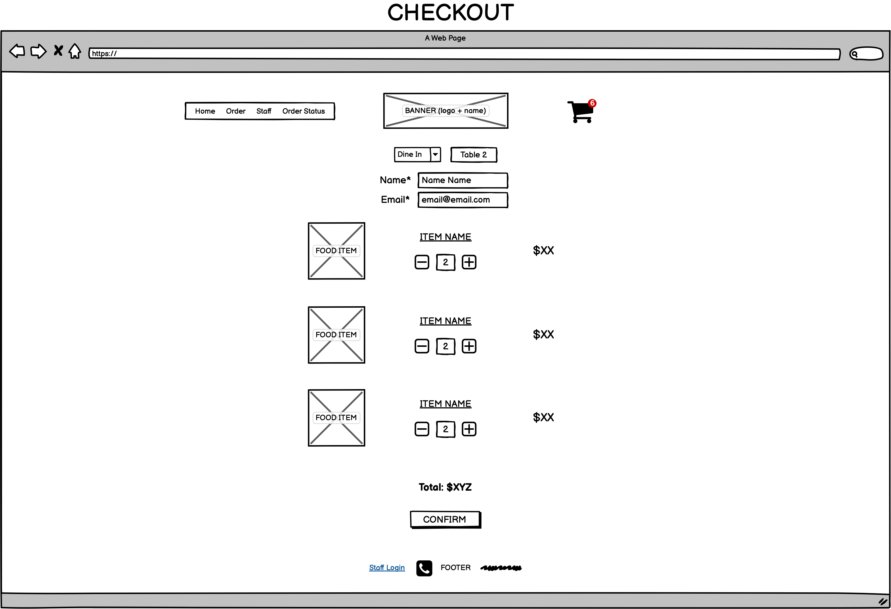
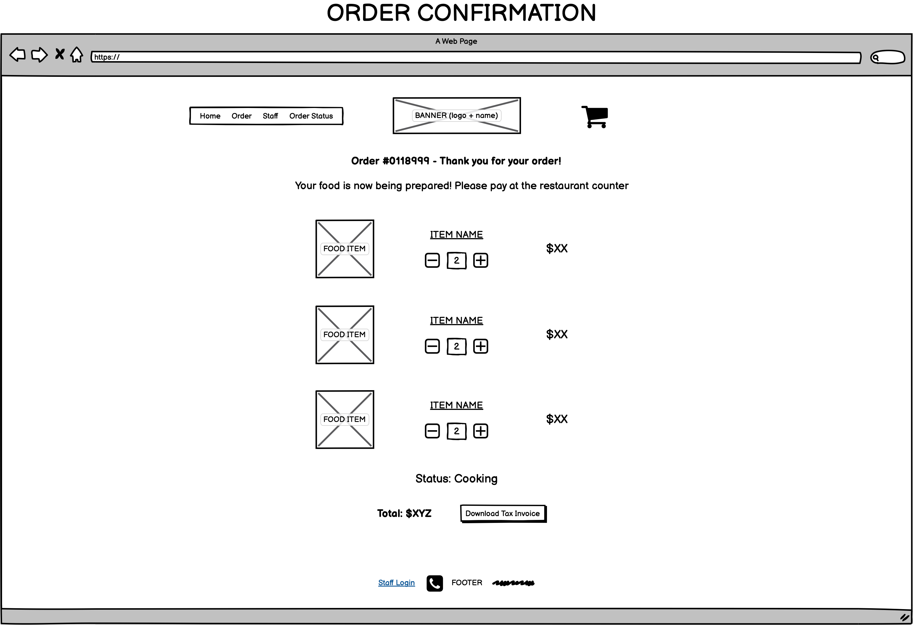

---

## Planning Methodology

For our planning methodology, we have adopted an agile approach, with task management achieved through Kanban, implemented on the Trello platform.

As we are a team of two, we are able to emphasise flexibility as a smaller team is easier to manage. The two of us are in constant communication, and continually review and revise every aspect of the project, both on a macro level (features, design, vision), and also on a micro level (implementation details).

We have daily meetings that at the very least review our progress for the day, any blockers, and what we plan to do next. These meetings cover the status of each ongoing task, and usually include more general planning and discussion elements as well.

Every task that comes to mind that might need doing goes into the ‘Backlog’ column of our Kanban board on Trello. At the Backlog stage, additional details surrounding due dates, team member allocation and complexity are (unless obvious) not included. This stage is simply to ensure that a given task is not neglected down the track. It is important to note that a given task may or may not actually get done - wishlist features for example also go into the Backlog column.

From the Backlog column, we move any tasks that need doing as a priority to the ‘To Do’ column. It is at this stage that supplementary details are added including those mentioned above, and checklists. The task's complexity is assigned to be one of the Fibonacci numbers to facilitate easier estimation (frequently used in Agile - see <https://www.lucidchart.com/blog/fibonacci-scale-for-agile-estimation> for more detail). If a task’s complexity estimate is deemed to be ‘too large’ (this is a flexible definition depending on many factors, but usually not above a 5 or an 8) then this card is broken down into smaller tasks.

Once we are working on a task, it moves to the ‘Doing’ column. Each person only has 1-2 tasks in progress at a time - in line with general Kanban principles - which aims to increase the rate of ‘flow’ (the speed with which tasks get done). Having a set task limit helps because in addition to our individual tasks, we need to review the other team member’s work.

In using this however, we found that on occasion, a task was not able to progress through to completion because of some other prerequisite that needed doing. Because of this, we later added a 'Blocked' column, to hold any tasks that have been started, need further work, and cannot be worked on right now. This had the added benefit of really being able to limit our 'Doing' tasks to 1 per person most of the time.

Items are moved to the ‘Code Review’ column, when they are completed by the assignee, and need to be reviewed and approved by the team member (i.e. when the pull request has been made). If significant reworks are required, another card may be added at this stage with details of the changes. For minor amendments, these are made immediately, and only then do the cards move on to the next phase.

The ‘Test’ column is for code that has been written and reviewed, but needs to have testing implemented.

Once reviewed (and if relevant, tested), cards are moved to the ‘Complete’ column.

### Source Control Methodology

We have decided to use branching rather than forking to manage our repositories collaboratively. We considered using forking, however this was discounted as for a team of two working closely, and in constant communication it was deemed to not provide any additional features that are useful to us in this context. The main benefit of forking as we see it is that the main repository has a single person/administrator having final say / control over what code is included/merged in. For us this is clearly unnecessary as the people contributing to the project is necessarily limited to just us 2, and so we do not need to further control who can submit PRs and merge. In addition, forking would mean managing 2 copies of each repository which is more work, and would require branches to develop features anyway, so also does not save time in any aspect either.

We also are required by the assignment specifications to keep branch history intact (i.e. we cannot delete branches). Therefore, we have decided to make a new branch for each edit (even if it is related to the same task/feature), e.g. wireframes/edit_1, wireframes/edit_2 etc. so as to avoid merge conflicts.

Our end to end process therefore, is as follows:

- Create a new, uniquely named branch to work on a new feature, or even a new edit of an existing branch (e.g. each time we edit the readme is a new, distinct branch 'readme/edit_1', 'readme/edit_2' etc.)
- Work, commit, push
- Pull request to merge into main
- Other team member checks the work, and if approved, merges the pull request into main
- Repeat

### Trello screenshots

Below are daily screenshots from our Trello board.

#### 22nd January 2022<!-- omit in toc -->

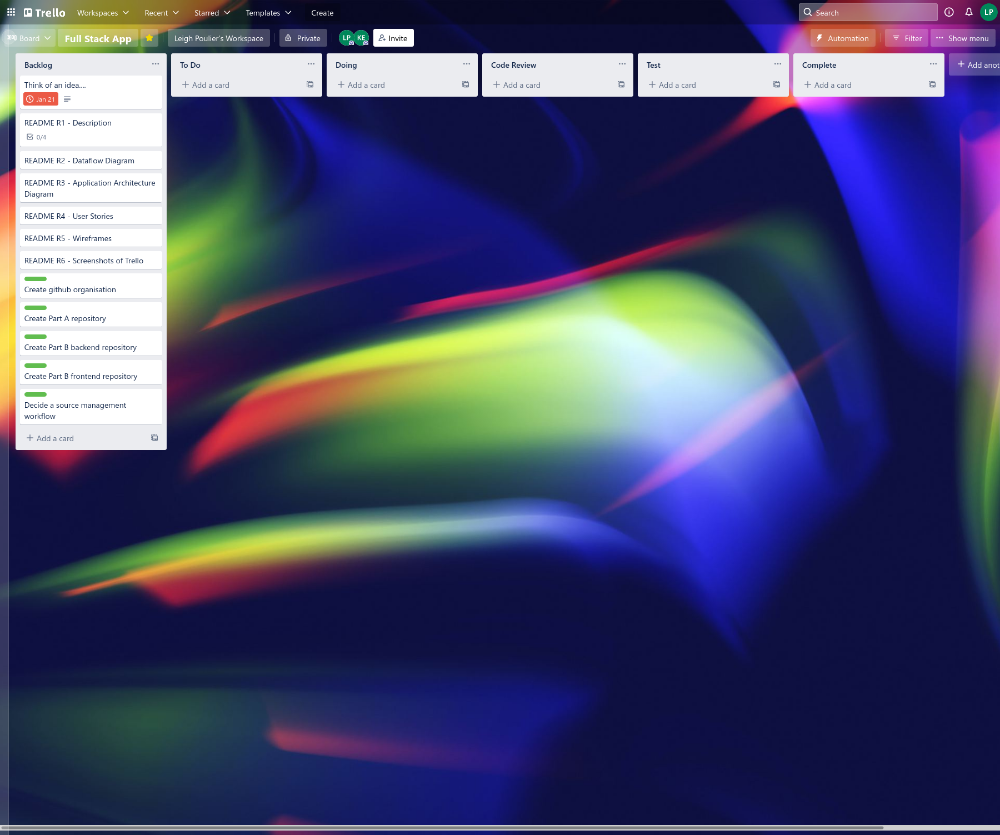

#### 23rd January 2022<!-- omit in toc -->

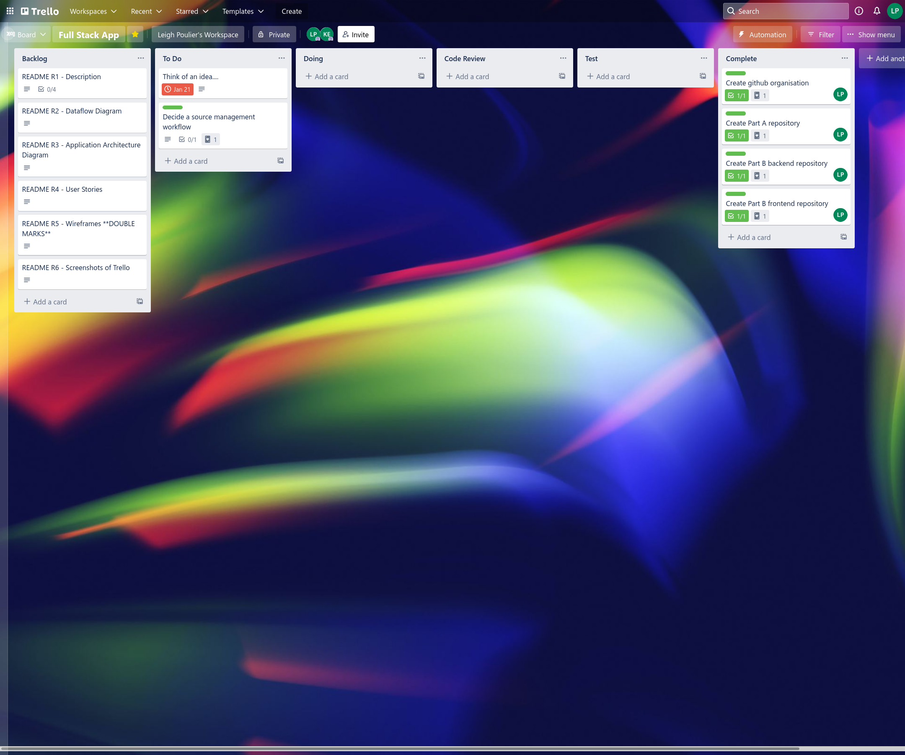

#### 24th January 2022<!-- omit in toc -->

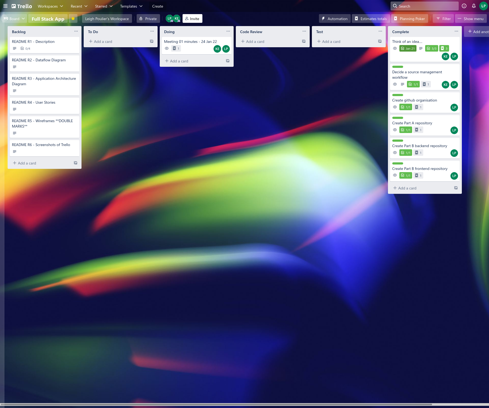

#### 25th January 2022<!-- omit in toc -->

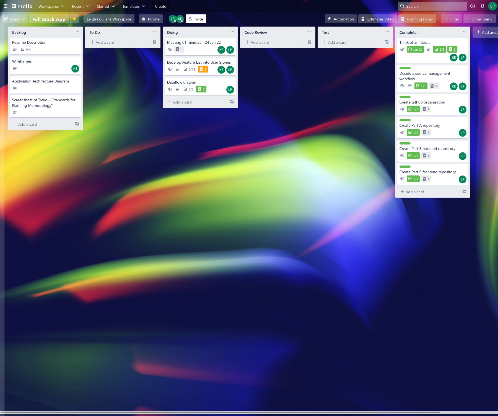

#### 26th January 2022<!-- omit in toc -->

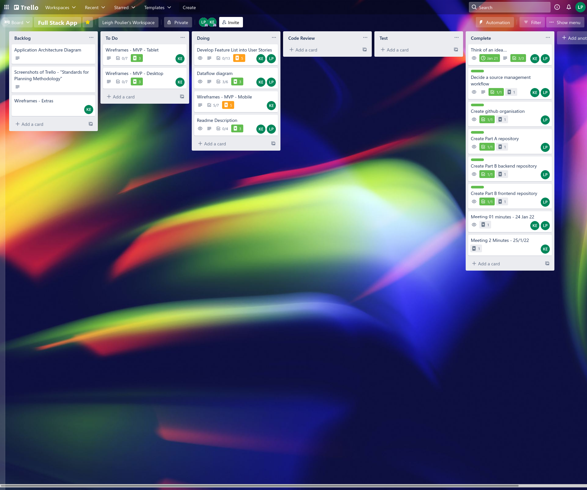

#### 27th January 2022<!-- omit in toc -->

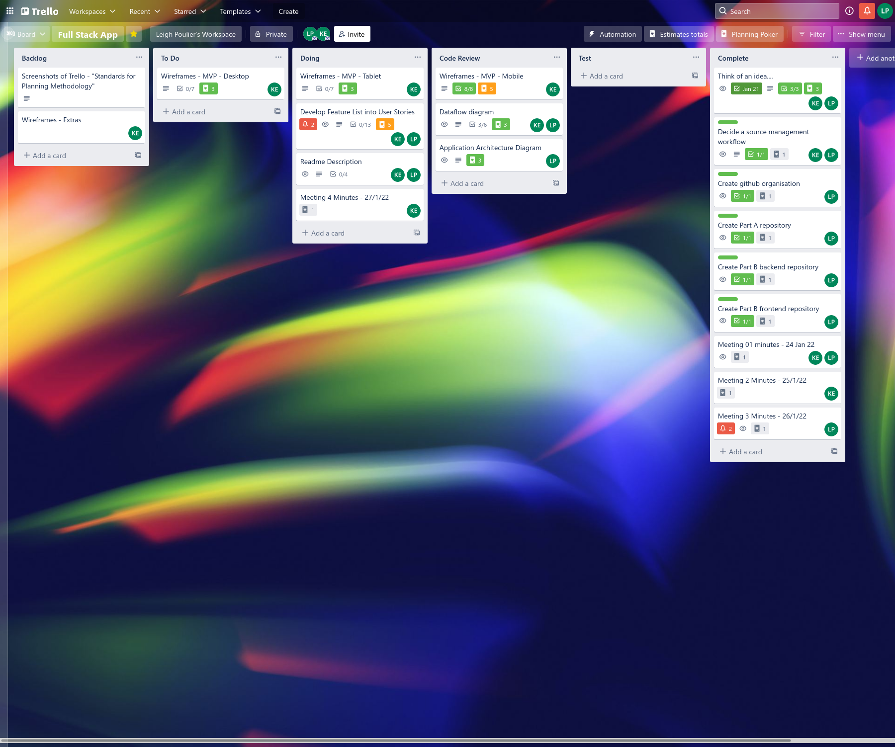

#### 28th January 2022<!-- omit in toc -->

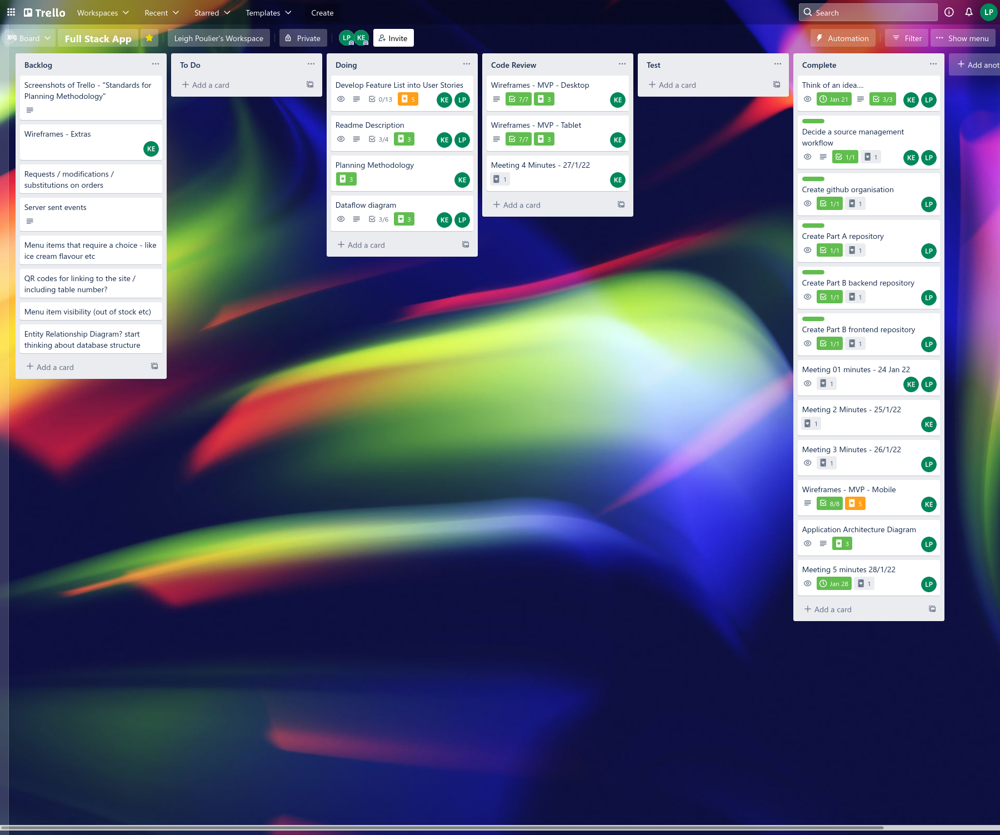

#### 29th January 2022<!-- omit in toc -->

#### 30th January 2022<!-- omit in toc -->

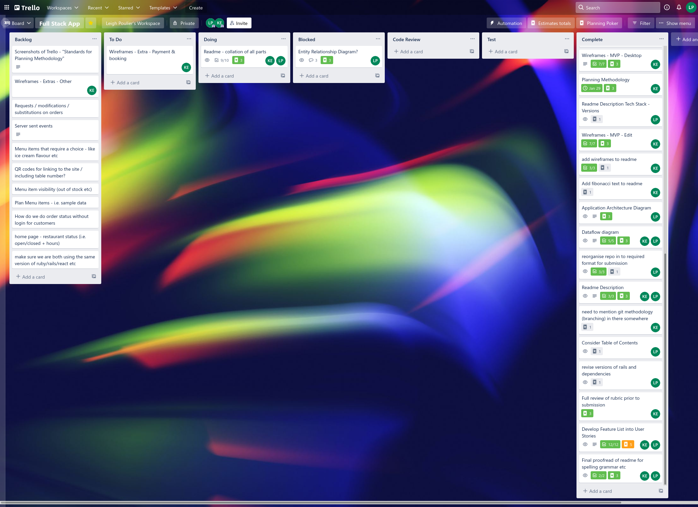

### Daily Standup Meeting Minutes

- [Meeting Minutes - 24/1/22](./docs/meeting_minutes/Meeting%2001%20-%2024%20Jan%2022.md)
- [Meeting Minutes - 25/1/22](./docs/meeting_minutes/Meeting%2002%20-%2025%20Jan%2022.md)
- [Meeting Minutes - 26/1/22](./docs/meeting_minutes/Meeting%2003%20-%2026%20Jan%2022.md)
- [Meeting Minutes - 27/1/22](./docs/meeting_minutes/Meeting%2004%20-%2027%20Jan%2022.md)
- [Meeting Minutes - 28/1/22](./docs/meeting_minutes/Meeting%2005%20-%2028%20Jan%2022.md)
- [Meeting Minutes - 29/1/22](./docs/meeting_minutes/Meeting%2006%20-%2029%20Jan%2022.md)
- [Meeting Minutes - 30/1/22](./docs/meeting_minutes/Meeting%2007%20-%2030%20Jan%2022.md)
